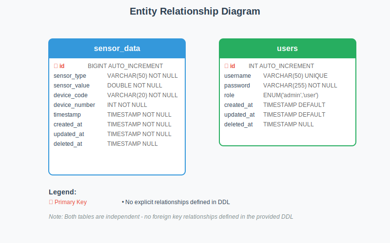

# 🛰️ Sensor Platform Backend


This project is a backend system for processing data streams from multiple sensors and human inputs.  
The system is built using **Go (Echo framework)**, **MySQL**, and follows a **microservices architecture**.  
It is designed to generate, receive, process, and store sensor data, while exposing REST APIs for analytics and management.

---

## 📋 Table of Contents


1. [Project Scopes](#project-scopes)  
2. [Assumptions](#assumptions)  
3. [Process Flow](#process-flow)  
4. [Tech Stack](#tech-stack)  
5. [Prerequisites](#prerequisites)  
6. [Database Entity Relationship Diagram (ERD)](#database-entity-relationship-diagram)  
7. [Setup & Run](#setup--run)  
8. [API Contract](#api-contract)  
9. [Limitations & Future Improvements](#limitations--future-improvements)

---

## 📍 Project Scopes 


The project will deliver the following:  

1. A microservice (**Microservice A**) that simulates sensors by generating data records with the following fields:  
   - Sensor value (float)  
   - Sensor type (string)  
   - Device code (renamed from ID1, alphabets in capital letters)  
   - Device number (renamed from ID2, integer)  
   - Timestamp  

2. The frequency of data generation can be configured through a REST API endpoint.  

3. Multiple instances of **Microservice A** can run at the same time, with each instance producing data for only one fixed sensor type (e.g., temperature, humidity, pressure).  

4. Another microservice (**Microservice B**) will be created to receive and process the data stream from Microservice A using gRPC, MQTT, or an equivalent protocol.  

5. **Microservice B** will compile and store the received data in a MySQL database in a structured format, making it easy to manage and retrieve.  

6. **Microservice B** will provide REST API endpoints to:  
   - Retrieve data based on device code and device number.  
   - Retrieve data based on a time range.  
   - Retrieve data based on a combination of device identifiers and timestamps.  
   - Edit and delete data using the same filtering options.  
   - Support pagination when retrieving large sets of data.  

7. Authentication and authorization will be implemented to ensure secure access to the API endpoints.  

8. **Microservice B** will be designed to handle input from multiple Microservice A instances simultaneously and support scalability as the number of devices grows.  

9. The system will be tested by running many instances of **Microservice A** to push the scalability limits of **Microservice B**.  

---

## ⚡ Assumptions  


- Sensors are simulated and not connected to real hardware.  
- Device code will be randomly generated from A–Z.  
- Device number from sensor data will be randomly generated in the range of 1–1000 and cannot be zero.  
- Sensor data generation starts automatically when the service runs and continues until shutdown, with APIs available to manually start or stop the process.  
- Sensor value will be randomly generated based on the sensor type and within the possible range for that sensor type.  
- Sensor data is produced at regular intervals (default: 5 seconds) and generated from multiple instances.  
- The regular interval for producing sensor data cannot be less than 5 seconds.  
- A login process is required before accessing features such as viewing, editing, or deleting sensor data.  
- The system defines two roles: **admin** and **user**. Admins can view, edit, and delete data, while users are limited to viewing and editing only. Since deletion carries higher risk, it is restricted to admins.  
- A registration feature is available to create new users by providing a username, password, and role for simplicity the input. Meantime, registration must be completed before login.  
- Sensor data can be retrieved through a single API that supports filtering (by device code, device number, start time, and end time) and pagination (page and limit).  
- Sensor data can be deleted or updated using filtering, with restrictions:  
  - Deletion or update cannot occur if the start time is later than the end time.  
  - Deletion or update cannot be performed without a filter.  
- For the update feature, only specific fields can be modified: **sensor type**, **sensor value**, and **timestamp**. 

---

## 🧑‍💻 Process Flow

// put the flow in here //

// put the image in here //

---

## 🛠 Tech Stack


### Core
- [Go](https://golang.org/) `v1.23.0` – Main programming language
- [Echo](https://echo.labstack.com/) – Web framework for building REST APIs

### Database & Migration
- [MySQL](https://www.mysql.com/) `v8.0.43` – Relational database
- [golang-migrate](https://github.com/golang-migrate/migrate) – Database migrations
- [sqlc](https://sqlc.dev/) – Generate type-safe Go code from SQL

### Messaging
- [Apache Kafka](https://kafka.apache.org/) – Message broker for sensor data
- [Zookeeper](https://zookeeper.apache.org/) – Coordination service for Kafka

### Authentication
- [JWT](https://jwt.io/) – Token-based authentication

### Containerization & DevOps
- [Docker](https://www.docker.com/) & Docker Compose – Containerization and orchestration

### Developer Tools
- [Postman](https://www.postman.com/) – API testing
- [DBeaver](https://dbeaver.io/) – Database management
- [Visual Studio Code](https://code.visualstudio.com/) – Code editor

---


## 📦 Prerequisites  


Before running the application, make sure you have the following installed:

- [Go](https://go.dev/) >= 1.23.0  
- [Docker](https://www.docker.com/) & [Docker Compose](https://docs.docker.com/compose/)  
  (used to run MySQL, Kafka, and Zookeeper — no local installation required)  
- [golang-migrate CLI](https://github.com/golang-migrate/migrate) (for database migrations)  
- [sqlc CLI](https://sqlc.dev/) (for generating type-safe Go code from SQL)  
- [Git](https://git-scm.com/) (for version control)  
- [Postman](https://www.postman.com/) (optional, for API testing)  
- [DBeaver](https://dbeaver.io/) (optional, for database management)  

---

## Database Entity Relationship Diagram (ERD)


The following Entity-Relationship Diagram (ERD) illustrates the database structure for sensor platform spesifically on **Microservice B**:



### Table Structure Overview

**sensor_data Table (Blue)**
- *Purpose*: Stores IoT sensor readings and measurements
- *Primary Key*: id (BIGINT) - uniquely identifies each sensor reading
- *Core Data*: Contains sensor type, measured values, and device identification
- *Key Fields*:
  - sensor_type: What kind of sensor (temperature, humidity, etc.)
  - sensor_value: The actual measurement reading
  - device_code & device_number: Identify which physical device sent the data
  - timestamp: When the reading was taken


| Column | Data Type | Constraints | Description |
|--------|-----------|-------------|-------------|
| `id` | BIGINT | PRIMARY KEY, AUTO_INCREMENT | Unique identifier for each sensor reading |
| `sensor_type` | VARCHAR(50) | NOT NULL | Type of sensor (e.g., temperature, humidity, pressure) |
| `sensor_value` | DOUBLE | NOT NULL | The actual measurement value from the sensor |
| `device_code` | VARCHAR(20) | NOT NULL | Alphanumeric code identifying the device |
| `device_number` | INT | NOT NULL | Numeric identifier for the device |
| `timestamp` | TIMESTAMP | NOT NULL, DEFAULT CURRENT_TIMESTAMP | When the sensor reading was recorded |
| `created_at` | TIMESTAMP | NOT NULL, DEFAULT CURRENT_TIMESTAMP | Record creation timestamp |
| `updated_at` | TIMESTAMP | NOT NULL, DEFAULT CURRENT_TIMESTAMP ON UPDATE | Last modification timestamp |
| `deleted_at` | TIMESTAMP | NULL | Soft delete timestamp (NULL = active record) |


**users Table (Green)**
- *Purpose*: Manages user authentication and access control
- *Primary Key*: id (INT) - uniquely identifies each user
- *Core Data*: User credentials and role-based permissions
- *Key Fields*:
  - username: Unique login identifier
  - password: Encrypted authentication credential
  - role: Access level (admin or regular user)

| Column | Data Type | Constraints | Description |
|--------|-----------|-------------|-------------|
| `id` | INT | PRIMARY KEY, AUTO_INCREMENT | Unique identifier for each user |
| `username` | VARCHAR(50) | NOT NULL, UNIQUE | User login identifier |
| `password` | VARCHAR(255) | NOT NULL | Encrypted password hash |
| `role` | ENUM('admin', 'user') | NOT NULL, DEFAULT 'user' | User access level |
| `created_at` | TIMESTAMP | DEFAULT CURRENT_TIMESTAMP | Account creation timestamp |
| `updated_at` | TIMESTAMP | DEFAULT CURRENT_TIMESTAMP ON UPDATE | Last profile update timestamp |
| `deleted_at` | TIMESTAMP | NULL | Soft delete timestamp (NULL = active account) |


### Key Features

**🔐 Security & Access Control**
- **Role-based permissions**: Users can be either 'admin' or 'user'
- **Unique usernames**: Prevents duplicate accounts
- **Password encryption**: Stored as hashed values for security

**📈 Data Integrity**
- **Primary keys**: Each table has a unique identifier
- **NOT NULL constraints**: Critical fields cannot be empty
- **Auto-increment**: Automatic ID generation for new records

**🕒 Audit Trail**
Both tables implement comprehensive audit logging:
- **created_at**: Tracks when records are first added
- **updated_at**: Automatically updates when records are modified
- **deleted_at**: Implements soft delete (records marked as deleted but not physically removed)

**📡 IoT Data Management**
The sensor_data table is optimized for high-volume IoT data:
- **BIGINT primary key**: Supports billions of sensor readings
- **Device identification**: Dual identifiers (code + number) for flexible device management
- **Flexible sensor types**: VARCHAR field accommodates various sensor categories
- **Precise timestamps**: Ensures accurate temporal data tracking

*This ERD represents the current database structure. Future iterations may include additional tables and relationships to support enhanced functionality.*
---

## 🚀 Setup & Run

1. **Clone the repository**

   ```bash
   git clone https://github.com/vincentweilasto16/sensor-platform.git
   ```

2. **Install dependencies**
   ```bash
   go mod tidy
   go mod vendor
   ```
3. Setup environment

   ```bash
   cp .env.example .env
   ```

   Adjust _.env_ to match your local PostgreSQL or Docker Setup

4. Create the database

   ```bash
   CREATE DATABASE wallet_db;
   ```

5. Run the application

   ```bash
   go run cmd/main.go
   ```

6. Test the API with Postman

---

## 📜 API Contract

1. **Get User By ID**
   Endpoint:

   ```bash
   GET /api/v1/users/:id
   ```

   Response (Success - 200 OK):

   ```bash
   {
    "data": {
        "id": "67e1e382-7122-4e77-b47f-f4e940cbf385",
        "name": "Andi Wijaya",
        "email": "andi.wijaya@example.com",
        "balance": 1500000,
        "created_at": "2025-08-15T17:17:21.515714+07:00",
        "updated_at": "2025-08-15T17:17:21.515714+07:00",
        "deleted_at": null
    },
    "meta": {
        "status": 200,
        "message": "ok"
    }
   }
   ```

   Response (Failure - User Not Found - 404 Not Found):

   ```bash
    {
        "data": null,
        "errors": [
            {
                "code": "NOT_FOUND",
                "message": "user not found"
            }
        ],
        "meta": {
            "status": 404,
            "message": "user not found"
        }
    }
   ```

2. **Withdraw**
   Endpoint:

   ```bash
   POST /api/v1/transactions/withdraw
   ```

   Request Body:

   ```bash
   {
    "user_id": "a440fd30-6894-4e93-b041-2f577c09d002",
    "amount": 20000
   }
   ```

   Response (Success - 200 OK):

   ```bash
   {
        "data": {
            "message": "Withdrawal successful"
        },
        "meta": {
            "status": 200,
            "message": "OK"
        }
   }
   ```

   Response (Failure - Insufficient Balance - 422 Unprocessable entity):

   ```bash
    {
        "data": null,
        "errors": [
            {
                "code": "UNPROCESSABLE_ENTITY",
                "message": "insuficient balance"
            }
        ],
        "meta": {
            "status": 422,
            "message": "insuficient balance"
        }
    }
   ```

   Response (Failure - User Not Found - 404 Not Found):

   ```bash
    {
        "data": null,
        "errors": [
            {
                "code": "NOT_FOUND",
                "message": "user not found"
            }
        ],
        "meta": {
            "status": 404,
            "message": "user not found"
        }
    }
   ```

---

## 🔮 Limitations & Future Improvements

- **Authentication & Authorization**

  - Implement JWT with Bearer tokens for all API endpoints.

- **Withdraw Transaction Handling**

  - Add rollback mechanism for failed withdrawals.
  - Implement idempotency to prevent duplicate withdrawals.
  - Add rate limiting for withdrawals.

- **Environments**

  - Separate configuration for development, staging, and production.

- **Testing & CI/CD**

  - Unit tests for controller and service layers.
  - GitHub Actions workflow for build & test.

- **Deployment**

  - Dockerfile for containerization.
  - Kubernetes manifests for deployment.

- **Monitoring**

  - Currently only basic logging; can be improved with Prometheus & Grafana.

- **Error Handling**

  - Could be enhanced with better structured error responses.

- **Feature Enhancements**
  - Expand transaction status (pending, refund, canceled, failed).
  - Integrate third-party payment gateways.
  - Prevent withdrawals when balance is zero (backend & frontend validation).

---

## 📦 Note


---
